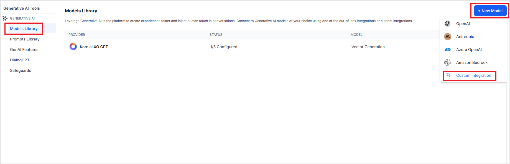
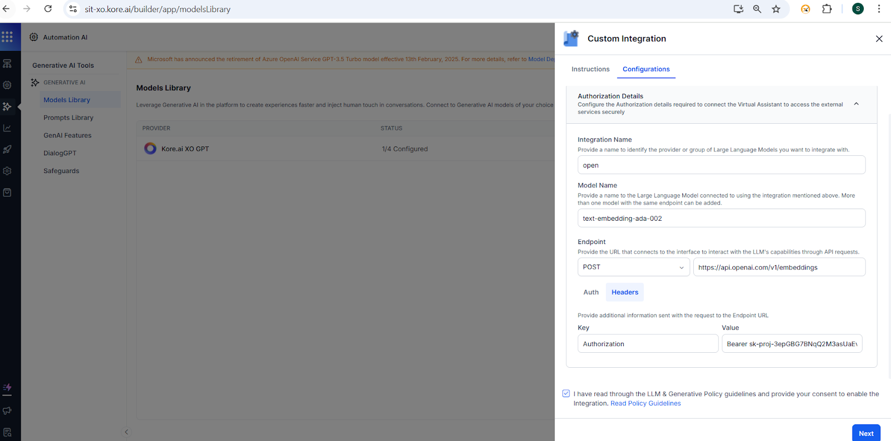
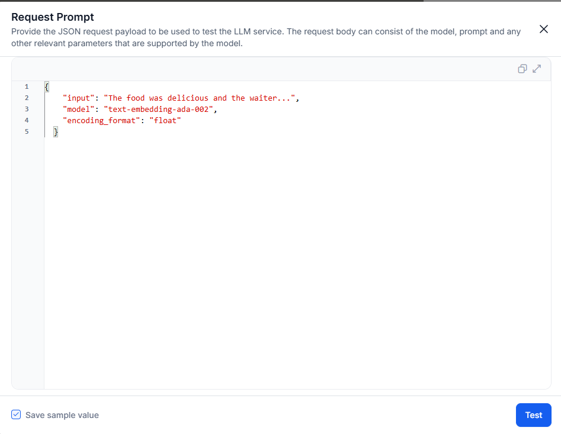

# Integrate a Custom Embedding Model 

Search AI allows you to connect and use your embedding model, hosted externally or internally. This gives you full control over how text is vectorized after ingestion. 

Using a custom embedding model can help you leverage domain-specific embeddings for improved search relevance or semantic understanding and ensure compliance with data privacy and security requirements. 

## Embedding Model Vector Dimensions for Custom Integrations

When integrating an embedding model, it’s crucial to ensure that it aligns with the supported vector dimensions. Below is a list of the vector sizes that we support.

**Supported Vector Sizes**

* 128
* 256
* 384
* 512
* 768
* 1024
* 1028
* 1536
* 2048
* 3072


## How it works

Integrating a custom embedding model involves three main steps:


1. Configure the custom model.
2. Create a custom prompt for the vector generation feature.
3. Enable the custom model and prompt for use in Search AI.


## Step 1: Configure Custom LLM for integration

For custom models or commercial models that are not natively integrated in Search AI, you must set them up using the Custom Integration option in Model Library. This allows you to connect to externally hosted models via their API endpoints. 

* Go to the **Model Library** under **Generative AI Tools**.
* Click on +**New Model** and select **Custom Integration**. 



* Go to the **Configurations** tab and provide the following details of the model. 

    * Integration Name:  A unique name to identify the integration.
    * Model Name: The name of your model. Example: text-embedding-ada-002
    * Endpoint: The hosted API endpoint that accepts requests and returns embeddings as response.
    * Auth: Authorization profile, if any, to be used for communication with the model. 
    * Headers: Any headers needed in the request (, like Authorization headers, etc. 

* Click on **Next** and provide the **Request Prompt**.



Enter the request payload to be sent to the model. This can depend on the model in use. 
Example: 

```
 {
    "input": "The food was delicious and the waiter...",
    "model": "text-embedding-ada-002",
    "encoding_format": "float"
  }
```


* Use the **Test** button to verify the response from the model. 
* On success, click **Save** to store the configuration.


## Step 2: Configure Custom Prompt

Go to the **Prompt Library** under **Generative AI Tools**.  Click on **+New Prompt**. Provide the details of the prompt. 


* Name - Unique name to identify the prompt. 
* Feature - Select **Vector Generation** from the drop-down.
* Model - Select the custom model integrated above. You cannot select Kore XO GPT model here. 
* Configuration - Upon model selection, the configuration details from the model are automatically  loaded.
* Request - Define the request. The request field depends on the model, it can include any context to be shared, prompt, and other parameters required for vector generation using the model. 
They keys list the dynamic fields available for use in the request object. Example: 

```
{"input":"{{embedding_input}}","model":"text-embedding-ada-002","encoding_format":"float"}
```


* Provide sample values for the dynamic variables like embedding_input and click on Test. This initiates a call to the model and generates the response corresponding to the request. 
* Response  - This field shows the response received from the model for the given request. 
* Text Response Path - Select the field from the response that contains the embeddings corresponding to the input. Double click on the field in the response and click Save. This populates the Response Path with the corresponding field from the response. 
    * Expected structure: The response field selected must contain an **array of numbers** representing the vector embeddings. For example, the model response should include a structure like this. In this example, the embeddings are available as embedding field. 
  
    ```json
    {
      "object": "list",
      "data": [
        {
          "object": "embedding",
          "index": 0,
          "embedding": [   -0.022822052,  0.01614314,  0.008042404,  ...],
          "model": "text-embedding-ada-002-v2",
          "usage": {
        "prompt_tokens": 3,
        "total_tokens": 3
          }
    }
    ```

* Click on Save. 

If the model’s response format does not match Search AI’s expected structure, use a **post-processor script** to transform the response.


## Step 3: Enable the configured model and prompt for use in Search AI. 


* Go to the Gen AI Features page. 
* For the Vector Generation feature
    * Select the model configured in Step 1
    * Select the prompt configured in Step 2. 
* Enable the feature. 

Search AI will now use your **custom embedding model** and **custom prompt** for generating embeddings.

## Fine-tune Embedding Models Using a Custom Utility

For improved relevance and accuracy in vector representations, you can fine-tune embedding models using your domain-specific custom datasets. The Search AI Toolkit offers a [Python-based utility to fine-tune pre-trained embedding models](https://github.com/Koredotcom/SearchAssist-Toolkit/tree/master/Utilities/FineTune%20Embeddings) available on Hugging Face. This enables better semantic understanding and thereby improved quality of embeddings, aligned with your business data.

Learn more: [Embedding Model Fine-tuning Utility](https://github.com/Koredotcom/SearchAssist-Toolkit/tree/master/Utilities/FineTune%20Embeddings)
