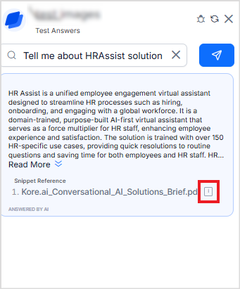

# Extract and Search Content from Image-Based Documents

Search AI can extract and interpret text from image-based content and use it for retrieval and answer generation. This capability enables responses to be generated from visual documents such as scanned PDFs, screenshots, and infographics. The effectiveness of answer generation depends on selecting the appropriate extraction strategy for the document type.

## Extraction Strategies Supported

Search AI supports two strategies for processing visual content. The right choice depends on the document type, layout and the LLMs you have configured.

* Image-Based Document Extraction (Recommended) - This strategy converts each page into an image and uses visual document retrieval embeddings to capture both textual and visual semantics. 
* Layout-Aware Extraction -  This strategy uses OCR and layout-detection models to identify and extract structured elements while respecting document hierarchy.

## Image-Based Document Extraction Strategy (Recommended)

This strategy is designed for complex PDFs that contain non-textual layouts, such as forms, tables, and visually rich structures, where standard text extraction is insufficient. It converts each page into an image and uses Vision embeddings to capture both textual and visual semantics. The tradeoff is that it requires specific LLM models that support image-to-answer generation, such as GPT-4o, and processes documents as images rather than granular text chunks.

Note: This strategy is supported for PDF files only. 

**How it works**

* Object Identification: Each page in the PDF is converted into an image. 
* Visual Embedding Generation: A vision embedding model generates embeddings that capture both textual and visual semantics. The default model available is VDR; custom vision models can also be configured. 
* Query Embedding: When a user submits a query, it is converted into two embeddings: one from a text model and another from an image model. Text embedding is used to search for information from text-based chunks. Image embedding is used to search for information from image-based chunks.
* Retrieval: The system retrieves the top 5 image chunks and top 20 text chunks, then sends them to the LLM for answer generation. For image chunks, the image URLs are also passed to the model, allowing it to access and interpret the images directly when forming the answer.

**Configuration**

* Upload Content. This strategy supports content in PDF files, uploaded directly or via connectors. 
* Set up an extraction strategy as image-based document extraction. 
* Train the application.
* Verify the images extracted as chunks in the Browse section.
* Go to the Index Configuration. If using the image-based extraction strategy: Under the Image tab, ensure that XO GPT - VDR embeddings Model is selected. You can use the default model or create a custom one. 
* Configure the retrieval and answer-generation settings. Use one of the following LLMs for answer generation.
    * OpenAI models - gpt-4o, gpt-4o-mini,
    * Azure OpenAI models -  GPT-4o, GPT-4o-mini, 
    
    !!! note 
     
        Custom LLMs and Amazon Bedrock are not supported. 

* Test the answers. Go to the Answer Generation page and use the Test Answer widget to verify the results. When queries are made against indexed images, the text extracted from the image is included in the generated answer. The complete image can be viewed by clicking the Preview icon next to the references.

## Layout Aware Extraction

Layout-Aware Extraction uses OCR and layout-detection models to identify and extract structured elements while respecting document hierarchy. This method offers flexibility for custom extraction rules and works with any LLM, making it ideal for standardized documents with predictable layouts. However, it may struggle with highly visual or non-standard formatting where context depends on spatial arrangement.

**How It Works**

* Object Identification: The system combines OCR, layout-detection models, and layout-aware rules to identify document elements.
* Structured Extraction: The model identifies different types of chunks present in a page; for example, text chunk, table chunk, image chunk. For text chunks, text extraction is used; tables are converted to HTML structures and stored; for images, OCR is used to extract all textual content from the images. 
* Retrieval & Generation: When a query is made, relevant chunks are retrieved and sent to the LLM. If the LLM uses text from the image-based chunks in its answer, the source image is also presented to the user

**Configuration**
* Upload Content. 
* Set Extraction Strategy. Select "Layout-Aware Extraction" .
* Train Application.
* Verify Chunks in the Browse section. 
* Configure Retrieval & Generation. All LLM models are supported with this strategy
* Test Answers. Use the Test Answer widget on the Answer Generation page to verify results.

## Viewing Image References in Answers

When an answer is displayed users can see both the text extracted from the image and references to the image from which the answer is generated. Click on the info icon to see the preview of the image.
 

## Summary

<table>
  <tr>
   <td>Criteria</td>
   <td>Image-Based Extraction  </td>
   <td>Layout-Aware Extraction </td>
  </tr>
  <tr>
   <td>File Support

   </td>
   <td>PDF only

   </td>
   <td>PDF and Docx

   </td>
  </tr>
  <tr>
   <td>Extraction Basis

   </td>
   <td>Visual + Textual semantics

   </td>
   <td>Text + Layout structure

   </td>
  </tr>
  <tr>
   <td>Retrieval Type

   </td>
   <td>Image + text

   </td>
   <td>text

   </td>
  </tr>
  <tr>
   <td>LLM Compatibility

   </td>
   <td>Limited to specified models

   </td>
   <td>Broader support

   </td>
  </tr>
  <tr>
   <td>Best Suited For

   </td>
   <td>Visually complex documents, including forms, tables, and infographics.

   </td>
   <td>Structured documents.

   </td>
  </tr>
  </table>