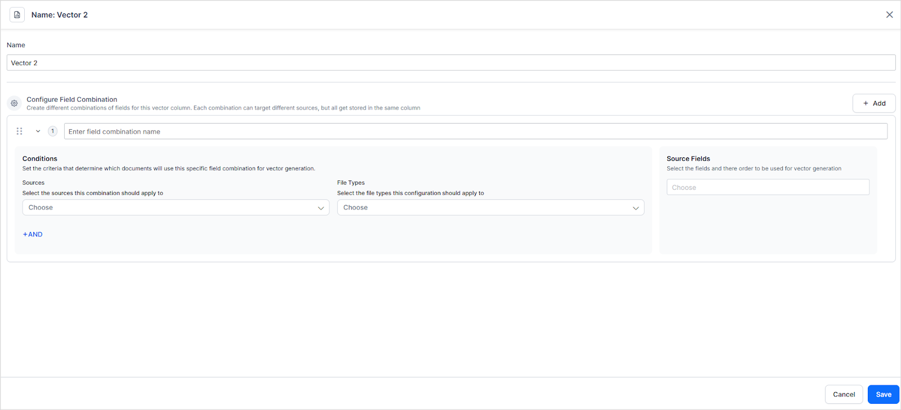

# Vector Configuration

Indexing is the process of generating vectors or embeddings from the extracted chunks and creating a knowledge Index that can be used for generating answers. 

Vectors or Embeddings are multidimensional numerical representations of the chunks that carry their semantic information. Embedding Models are algorithms that can translate data into those multidimensional numbers. The Kore XO platform features support for embedding models, including BGE-M3, VDR, and custom models, allowing you to select a model tailored to your specific needs.

**By default, when a new app is created, the BGE-M3 vector model is selected for generating embeddings.** 

## Features

* Select from the out-of-the-box embedding models supported by Kore.ai XO GPT for immediate use. These pre-integrated models work out of the box. If you have specific requirements, use a custom embedding model to gain full control over vector generation and tailor embeddings to your data and search needs.
* Choose the chunk fields on which the system generates embeddings. This selection lets you focus embedding generation on the fields most relevant to your specific use case.
* Multi-vector support allows you to generate multiple embedding vectors per chunk, with each vector tailored to capture different semantic aspects using distinct field combinations.

## Glossary

Here is a list of important terms related to vector configuration and generation. 

<table>
  <tr>
   <td>Vector
   </td>
   <td>A numerical representation of data that captures its semantic meaning. Also referred to as embedding. 
   </td>
  </tr>
  <tr>
   <td>Embedding model
   </td>
   <td>A machine learning model that converts data(text or images) into numerical vectors that capture the semantic meaning of the content.
   </td>
  </tr>
  <tr>
   <td>Multi-Vector
   </td>
   <td>Multi-vector refers to generating multiple vectors (embeddings) for each chunk, where each vector corresponds to different fields of the content, capturing distinct aspects of semantic meaning and relevance.
   </td>
  </tr>
  <tr>
   <td>Field Combination
   </td>
   <td>The specific combination of fields (example, Chunk Title, Chunk Text, Record Title) selected to generate a vector for a particular content type from a specific source.
   </td>
  </tr>
  <tr>
   <td>Vector Column
   </td>
   <td>A vector column represent the data columns that store embeddings. Column headers serve as identifiers that make your data meaningful and organized. For example, if an app is configured for a 3-vector search, each vector has a corresponding vector column. Hence, there are three vector columns. All the vectors generated through configurations of vector 1 are stored in vector column 1, with each subsequent vector stored in its corresponding vector column. 
   </td>
  </tr>
  <tr>
   <td>Vector Weight
   </td>
   <td>A numerical value (in percentage) assigned to each vector to specify its influence on retrieval. 
   </td>
  </tr>
  <tr>
   <td>Vision Models
   </td>
   <td>AI models designed to interpret, analyze, and understand visual data such as images.
   </td>
  </tr>
  <tr>
   <td>Rebalancing
   </td>
   <td>When a specific vector isn't available for a content chunk, its assigned weight is proportionally redistributed among the remaining vectors. This is referred to as rebalancing. This ensures that the weighted similarity scores add up correctly and the final relevance score remains consistent. 
   </td>
  </tr>
</table>

## Prerequisites

By default, the **Kore.ai XO GPT model** is configured for vector generation. To verify or update the embedding model:

1. Navigate to **Model Library** under **Generative AI Tools**
2. Verify that vector generation is enabled for the Kore.ai XO GPT model.

All the configured embedding models appear in the drop-down menu on the **Vector Configuration** page in Search AI.

## Vector Configuration For Textual Data

Configure the following fields used for vector generation. 

**Vector Model**: Select the embedding model to be used for Vector Generation. Select the most suitable embedding model depending on the nature of the content and the user queries expected by the application. 

**Prompt**: Select the prompt to be used for the model. 

Note: 

* For a custom embedding model, you can also create a custom prompt from this page using the **+New Prompt** option. 
* By default, the model and the prompt selected on the Gen AI page are automatically selected here for use. Any changes to the model or prompt are also reflected for the feature, Vector Generation - Text, in the Gen AI page. 

### Multi-Vector Search 

Search AI supports **multi-vector search** for textual data, allowing the generation of multiple embedding vectors for a single chunk. Each vector can represent a different semantic aspect by using one or more different fields of that chunk.

### How multi-vector search works

Multivector search involves the following steps:

#### 1. Configure Multiple Vectors

Begin by defining multiple vector configurations. Each vector can be customized to focus on specific content sources, file types, or field combinations (e.g., chunk text, record title, source name). This enables the system to capture varied semantic meanings from the same content chunk. 

[Learn more](#configuring-additional-vectorsvector-2-and-vector-3). 

#### 2. Assign Weights to Vectors

After setting up your vectors, assign a weight to each one to determine its impact on the overall relevance score during retrieval. Vectors with higher weights contribute more to the final ranking.

[Learn More](#assigning-weights-to-vectors).

#### 3. Retrieval Using Multiple Vectors

At query time, Search AI uses all configured vectors as follows:

* The user query is converted into a vector using the same embedding model(s) used for generating chunk vectors.
* The application performs vector similarity matching across all configured vectors for each chunk:
    * **Vector 1 score**
    * **Vector 2 score** (if available for that content)
    * **Vector 3 score** (if available for that content)
* Each similarity score is multiplied by its corresponding vector weight.
* A **final relevance score** is calculated by summing the weighted scores of all available vectors.
* Chunks are ranked based on these final scores, and the most relevant results are returned.

This approach ensures that each chunk is evaluated from multiple perspectives, while vector weights allow fine-tuning of relevance based on the importance of each vector's semantic focus.

### Configuration

Configure the following fields used for vector generation. 

**Vector Model**: 

Select the embedding model to be used for Vector Generation. 

* For textual content, select one of the following models:  BGE-M3, MPNet, LaBSE, E5, or a custom embedding model.  Select the model based on the nature of the content and the user queries expected by the application. 
* For image-based document extraction, the **VDR embedding model** is supported and is selected by default.  

**Multi-Vector Configuration**

This configuration directly impacts the search relevance and accuracy during retrieval. 

* Generate and assign up to **three different vectors** per chunk. 
* One of the three vectors (Vector 1) is always configured by default. This is mandatory and cannot be deleted. This is automatically configured and applied to **all content from all the sources**. The default vector uses the following fields for vector generation. You can change the source fields of the default vector but not the content source and file types. 
    * Chunk Title
    * Chunk Text
    * Source Name
    * Record Title

### Configuring Additional Vectors(Vector 2 and Vector 3)

Additional vectors must be manually configured in order to be enabled and used. To configure the second and third vectors:

Click on a vector entry and provide the following details:

* **Name:** Give the vector configuration a meaningful name to help identify its purpose.
* **Field Combination:** Define the conditions that determine which content the vector applies to and which fields are used for vector generation. Each field combination consists of three components.
    * Select the **source** (e.g., uploaded files, connectors). You can use the **AND **operator under the source drop-down to further narrow down the source on which the condition applies. 
    * Choose the relevant **File Types** (e.g., PDF, HTML) that are supported by the source to which the vector configuration applies. 
    * Select the **Fields** (e.g., Chunk Text, Chunk Title, Record Title) that the embedding model must use. Choose one or more fields from the source fields for a chunk to generate vector embeddings. 

    !!! note
        Selecting fields that are semantically rich improves the embedding quality and search response accuracy. If multiple fields are selected, the order of the fields matters, it influences the generated embedding vector.

**Example**: To use a custom field (cfs1) that contains the document summary for vector generation for the uploaded PDF files, configure the vector as follows. 

* Source: Files
* File Type: PDF
* Fields: cfs1

This configuration ensures that the embeddings generated for all the chunks corresponding to the PDF files from uploaded content use the specified fields.

You can define multiple field combinations by clicking the **Add** button. Adding multiple field combinations allows you to define the rules of embedding generation for different content types using different fields.

**Example** : Create Vector 2 with the following configurations:

* For web pages, use the fields - Title, Chunk Text, and a custom metadata field (cfs2).
* For all other content types, use Chunk Text and a custom summary field (cfs3).

### Field Combinations Precedence

When two or more field combinations are defined, the order is used to resolve the conflicts of assignment.

* Combinations are evaluated from top to bottom.
* The first matching combination is used for each content type.
* Place more specific combinations above generic ones.

For instance, if the first field combination(higher in order, placed first) is configured for Default Directory and another field combination is configured for all sources, the one on top takes precedence and is used for Default Directory. All other content, except that from the default directory, uses the second field combination for vector generation. 

### Vector Coverage

If the field combinations defined for a vector column don't cover certain content types, embeddings won't be generated for those content types. As a result, those content types won't be semantically matched using that particular vector column during search.

In such a case, the application automatically [rebalances the weights](#automatic-weight-rebalancing) among available vectors.

For instance, if Vector 2 is configured with fields that apply only to web files, then embeddings are generated only for web content in Vector 2. Other content types, such as PDFs or connector-based files, won't have embeddings in Vector 2 and therefore won't contribute to semantic matching for that vector column.

### Assigning Weights to Vectors

When using multiple vectors for search, you can control how much influence each vector has on the final results by assigning weights. This enables you to prioritize specific types of content or search criteria according to your unique needs.

Vector weights are assigned as percentages, and the total must equal 100%. These weights determine the extent to which each vector contributes to the calculation of semantic relevance during content retrieval.

To assign weights:

* Click **Manage Weights** in the Vector Configuration section.
* Set a percentage value for each configured vector. The total across all vectors must equal 100%.
* Adjust the values based on the importance of each vector to the search quality.

Example Configuration

Use case: A company wants to enhance semantic search across its content repository by capturing different aspects of the same document. The goal is to prioritize high-value technical summaries while still maintaining broad contextual coverage and supporting product-specific queries.

<table>
  <tr>
   <td><strong>Vector</strong>
   </td>
   <td><strong>Vector Generation Fields</strong>
   </td>
   <td><strong>Weight</strong>
   </td>
   <td><strong>Rationale behind weight assignment</strong>
   </td>
  </tr>
  <tr>
   <td>Vector 1  Title-Focused Vector
   </td>
   <td>Chunk Text, Chunk Title
   </td>
   <td>30% 
   </td>
   <td>Covers a wide range of general information through the title and content. 
   </td>
  </tr>
  <tr>
   <td>Vector 2

Summary-Focused Vector
   </td>
   <td> Summary (cfs1)
   </td>
   <td>50%
   </td>
   <td>Prioritized for its high semantic significance
   </td>
  </tr>
  <tr>
   <td>Vector 3
Metadata-Driven Vector
   </td>
   <td>Product Name (cfs2), Version (cfs3)
   </td>
   <td>20%
   </td>
   <td>More specific but limited in use
   </td>
  </tr>
</table>

### Automatic Weight Rebalancing

In a multi-vector setup, Search AI allows you to assign weights to different vector columns based on their importance. However, not all vector columns may be configured for every content type. For instance, if a vector column is configured only for specific content types, such as web pages or PDFs, it won’t generate embeddings for content from other sources, including connectors or files.

To ensure scoring remains accurate and relevant chunks don't receive reduced weighting, the system redistributes the missing vector's weight proportionally among the available vectors. This is referred to as Automatic Weight Rebalancing. 

Automatic weight rebalancing ensures fair and accurate scoring during multi-vector search, even when embeddings are unavailable in certain vector columns for specific content types. It prevents skewed results by proportionally redistributing the missing vector’s weight among the remaining vectors for the chunk, ensuring that relevant content isn't underrepresented. This improves retrieval accuracy and eliminates the need for manual adjustments.

For instance, suppose three vectors are configured as follows. 

* Vector 1 - Configured for all sources, uses fields a, b, and assigned weight is 50%
* Vector 2 - Configured only for web pages, uses fields c, d, and assigned weight is 20%
* Vector 3 - Configured for all sources, uses fields e,f, and assigned weight is 30%

So the vectors generated corresponding to the chunks would be something like this:

<table>
  <tr>
   <td>
   </td>
   <td>Vector 1 (

configured for all sources and uses fields a,b)
   </td>
   <td>Vector 2( configured only for web pages and uses fields c,d
   </td>
   <td>Vector 3(configured for all sources and uses fields e,f)
   </td>
  </tr>
  <tr>
   <td>Chunk 1 

(from web page)
   </td>
   <td>x1
   </td>
   <td>y1
   </td>
   <td>z1
   </td>
  </tr>
  <tr>
   <td>Chunk 2

(from an uploaded file)
   </td>
   <td>x2
   </td>
   <td>Not available
   </td>
   <td>z2
   </td>
  </tr>
  <tr>
   <td>Chunk 3

(from a connector)
   </td>
   <td>x3
   </td>
   <td>Not available
   </td>
   <td>z3
   </td>
  </tr>
  <tr>
   <td>Chunk 4

(from connector)
   </td>
   <td>x4
   </td>
   <td>Not available
   </td>
   <td>z4
   </td>
  </tr>
</table>

For all chunks generated from any sources other than web pages, embeddings won't be generated corresponding to vector 2. Now, unless the weights are rebalanced, the total weight used to compute the final relevance score of Chunks 2, 3, and 4 would be incomplete, leading to inaccurate or biased scoring. Rebalancing ensures that the missing weight from vector 2 is proportionally distributed among the remaining vectors. 

In this example, for chunks for which Vector 2 embeddings aren't available, the 20% weight is redistributed proportionally between Vector 1 and Vector 3. Adjusted weight is calculated using the following formula:

Adjusted Weight = Original Weight + ((Unavailable Weight × Original Weight)/ Sum of Available Weights)

This results in the following adjusted weights of embeddings in vectors 1 and 3 corresponding to Chunks 2,3, and 4 :

* Vector 1 - 62.5%
* Vector 3 - 37.5%

### Points to Note

* You cannot disable the default vector.
* Avoid conflicting conditions across vector definitions to ensure each vector applies clearly and uniquely.
* Whenever you switch from one embedding model to another, add or update a vector configuration, and reassign weights, **Train** the application to generate the embeddings again per the new configurations. 

## Vector Configuration for Image-based data 

This configuration is required only when content is extracted using the Image-based Document Extraction method. 

**Vector Model**: For image-based document extraction, **VDR embedding model** is supported and is selected by default. 

**Prompt**: Select the prompt to be used for vector generation of image based content. You can select the existing prompts or create a new prompt from this page. 

!!!note 
      Any changes made to the prompt for this feature automatically reflect in the Vector Generation - Image feature under the Gen AI page. 
