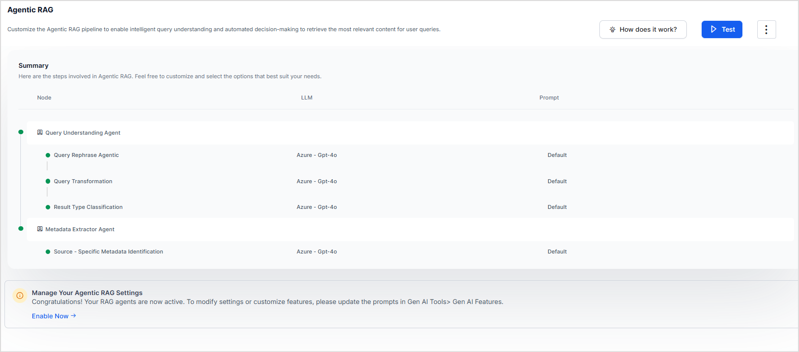

# Agentic RAG

**Agentic RAG** is an advanced form of RAG that uses **autonomous agents** to improve query understanding and retrieval accuracy. By dynamically adapting the retrieval process based on the context and intent of user queries, Agentic RAG is particularly effective when working with structured data enterprise applications.

## Why Agentic RAG?

The current search architecture, optimized for unstructured data, shows limitations when handling structured data from sources like JIRA. Specific queries yield suboptimal results due to the static retrieval configuration. 

Agentic RAG leverages LLMs to add an intelligent layer that can dynamically adapt retrieval strategies based on query intent, moving away from the current one-size-fits-all approach. The agents in this RAG architecture analyze query intent to determine optimal retrieval parameters and filters, enabling dynamic adaptation of search strategies based on query context. 

## Agents in Agentic RAG

Currently, the following four agents are introduced in Search AI. 

### Query Rephrase Agent

The **Query Rephrasing Agent** enhances and clarifies user queries by understanding the context and user intent. Using previous conversations, it provides improved versions of user input, resulting in more precise and actionable queries.	

**Example:**

* **User Query:** "What about India?"
* **Previous Conversation:** "What is the leave policy for America?"
* **Rephrased Query:** "What is the leave policy for India?"

!!!note
    This agent is currently available only for the advanced Search API. Please refer to the [API documentation](../apis/searchai/advance-search.md) to learn more about its usage.

### Result Type Classification

The **Result Type Classification Agent** interprets queries to determine whether the user seeks a specific answer or a list of search results. This ensures that the application responds with the most appropriate result type.

For instance, 

* **Query:** "Give me a list of tickets assigned to John." 
* **Output:** *search*
* **Query:** "Give me details on the custom embeddings story." 
* **Output:** *answers*

!!!note
    This agent is applicable solely when search results are enabled. Currently, search results are accessible only through the APIs. Please enable this agent only when utilizing search results via the API.

### Query Transformation Agent 

The **Query Transformation Agent** identifies key terms within a query, removing noise and prioritizing relevant documents. Extracting meaningful phrases and keywords ensures that results are aligned with the user's intent.

**Query**: "What is the work-from-home policy for Kore.ai?"

**Processing:**

* **Extracted Key Terms:** *"Work from Home Policy", "Kore.ai"*
* **Refined Query:** *"Kore.ai work-from-home policy details."*
* **Boosting Applied:** Documents containing these terms in the **title or content** are ranked higher.

### Metadata Extractor Agent

The Metadata Extractor **Agent** extracts relevant sources and fields from a query, maps them to structured data, and applies filters or boosts for accurate retrieval. This agent ensures the system applies appropriate filters to refine the results.

**Query**: *"Find Jira tickets assigned to John with status ‘In Progress’ and priority ‘High’."*

**Processing:**

* **Source Identified:** Jira
* **Extracted Fields:** Assignee, Status, Priority
* **Action Taken:**
    * **Filter Applied**
    * **No Boost Needed**

## Enabling Agentic RAG

### Prerequisites

* Configure LLM. Note that currently, only Open AI and Azure Open AI 4.0 models are supported for Agentic RAG. 

### Steps to Enable

To enable Agentic RAG, go to Agentic RAG under responses and click **Enable Now**. 

Select the model for Agentic RAG and click **Confirm**. 

By default, this enables all the RAG agents. All the agents use the model configured while enabling the Agentic RAG. 

To change the model and prompt settings or to enable or disable a particular agent, go to the [**Gen AI features**](../generative-ai-tools/genai-features.md) under **Generative AI Tools** and make appropriate settings. 

The following table displays the supported models for each of the agents. 

(✅ Supported | ❌ Not supported)

| Model     | Metadata Extractor Agent     | Query Rephrase Agent (for Advanced Search API)     | Query Transformation  Agent   | Result Type Classification  Agent  |
|---|---|---|---|---|
| Azure OpenAI -   GPT 4, GPT 4 Turbo     |  ❌     | ❌     | ❌     | ❌     |
| Azure OpenAI - GPT 4o, and GPT-4o mini*     |  ✅     | ✅     | ✅     | ✅     |
| OpenAI - GPT 3.5 Turbo, GPT 4, GPT 4 Turbo     | ❌     | ❌     | ❌     | ❌     |
| OpenAI -   GPT 4o, and GPT-4o mini*     | ✅     | ✅     | ✅     | ✅     |
| Custom LLM     |  ✅   (If underlying llm is GPT 4o / GPT 4o mini)     | ✅   (If underlying llm is GPT 4o / GPT 4o mini)     | ✅   (If underlying llm is GPT 4o / GPT 4o mini)     | ✅   (If underlying llm is GPT 4o / GPT 4o mini)     |
| Kore.ai XO GPT     | ❌     | ❌     | ❌     | ❌     |
| Amazon Bedrock     | ❌     | ❌     | ❌     | ❌     |

## Testing the Agentic RAG feature

To test the performance of the agents, use the **Test** option on the Agentic RAG page. Enter your query and verify the response to the query. When Agentic RAG is enabled, an additional **Retrieval** tab is added to the debug logs. This page provides information on the sequence of agents invoked by the application, the input to the LLM by each agent, and the output from the agents. It also shows the time taken by the LLM to complete the request. 

## Points to Note

When implementing Agentic RAG to enhance query accuracy, keep the following points in mind:

* **Response Time**: The architecture involves multiple LLM calls, which may impact the overall response time for users. It's important to factor this into system performance expectations.
* **Cost Efficiency**: The query enrichment node utilizes metadata from various sources, resulting in larger prompt sizes. This can increase token usage and consequently impact overall costs. Budgeting for these factors can help optimize resource allocation. 
* **Control Mechanisms**: While the LLM dynamically handles decisions on boosting versus filtering, additional fine-tuning mechanisms may be beneficial. This can enhance the effectiveness of the system based on specific use cases. 
* **Source Accuracy**: Inaccurate source identification may lead to the retrieval of irrelevant or incomplete results. Maintaining high standards for source quality can improve the relevance of the information retrieved. 

These considerations can help in maximizing the performance and efficiency of Agentic RAG in your applications.
