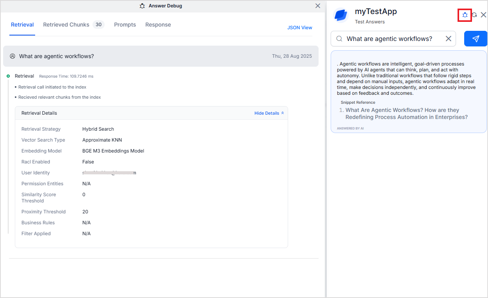
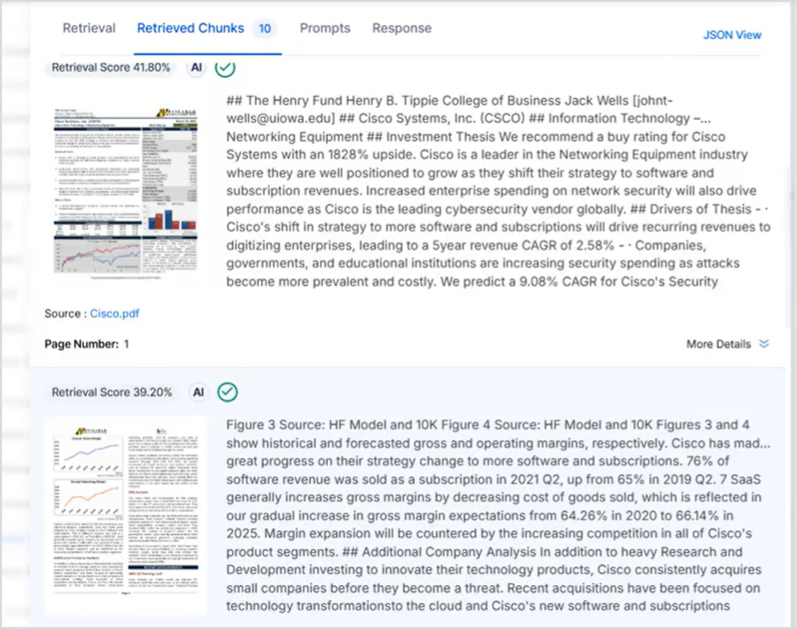

# Testing and Debugging Answers

Search AI provides you with a simulator to test the performance and accuracy of the generated Answers and fine-tune your configuration as per your business needs. This helps identify and rectify inaccuracies and performance bottlenecks or inefficiencies before the application is deployed and goes live for the users.

To test answers, go to the **Answer Configuration** page and click the **Test Answers** button. 

This presents a simulator. 

Enter a query to see the corresponding generated answer.

If the answer generation fails for any reason, an error message will be displayed here. Please refer to the list of errors and their potential causes.

The simulator also provides a **debugger**. The debug option is enabled after the answer is generated for your search. Click the debug icon to get insights into the answer generation process.

The **Debugger** is displayed on the left of the preview widget. The debug information is available under the following tabs:

**Retrieval**:  Displays the details of the retrieval and re-ranker process. 

The **Retrieval panel** provides a comprehensive view of the retrieval configuration. It includes the following fields:

* **Retrieval Time** – Displays the actual processing time (in milliseconds).
* **Embedding Model** – Indicates the embedding model used for retrieval.
* **Source Fields** – Lists the fields utilized during retrieval.
* **Business Rules** – Shows the applied business rules.
* **Retrieval Strategy** – Displays the retrieval strategy type.
* **Permission Entities** – Shows the status of access control and applied permission entities.
* **User Identity** – Displays the current user context.
* **Filters Applied** – Lists any active filters or constraints.
* **Similarity Score Threshold** – Displays the minimum similarity score (percentage).
* **Proximity Threshold** – Displays the applied proximity filtering percentage.

The **Re-ranker panel** provides details of the re-ranking process. It includes the following fields:

* **Re-ranking Time** – Displays the processing duration (in milliseconds).
* **Model** – Indicates the re-ranking model used.
* **Re-rank Fields** – Lists the fields considered during re-ranking.
* **Number of Chunks** – Displays the total number of chunks processed.
* **RACL** – Shows the access control status based on Role-based Access Control Lists.
* **User Identity** – Displays the user context applied during re-ranking.

If Agentic RAG is enabled, this tab also provides information on the sequence of agents invoked by the application, the input to the LLM by each agent, the output from the agents, and the time taken by the LLM to fulfill the request. 

**Retrieved Chunks:** This tab provides information about the chunks used in the answer generation.  

* **Qualified Chunks**: Lists all the relevant chunks along with the similarity score for the chunk, the source of the chunk, and the name of the source of the chunk.
* **Sent to LLM**: Lists only the chunks that are sent to the LLM for answer generation. 
* **Used for Answering**: Lists the chunk used for generating the answer. 

For each chunk in each of the lists, the similarity score for the chunk, the source of the chunk, and the name of the source are also displayed. The similarity score indicates the relevance of the chunk to the search query. The higher the score, the more relevant the chunk for the answer. Of all the qualified chunks, the top chunks, based on this score, are sent to the LLM model for answer generation. It is also marked if the chunk is sent to the LLM model for answer generation.

If the chunks include visual information in the form of images, a thumbnail of these images is displayed alongside the chunk card, as shown below. 

**Prompts**: Under the Prompt tab, you can find the details of the prompt or the textual inputs sent to the LLM model. The top section shows the internal parameters that are used by the Search AI application to fine-tune the output from the LLM model, along with their values.

The prompt sent to the LLM model for answer generation is displayed in the bottom pane. A prompt consists of a set of instructions along with a few shot examples sent to the LLM model and enables it to generate desired results accurately.  You can use this section to verify if the prompt is defining the objective, tone of response, and format of the response properly. 

**Response**: This tab shows the results sent by the LLM back to the Search AI application in JSON format. It also provides performance statistics like the time taken in vector search for the query and the time taken in answer synthesis. 

To view all the information in JSON format, click the **JSON view** link.

